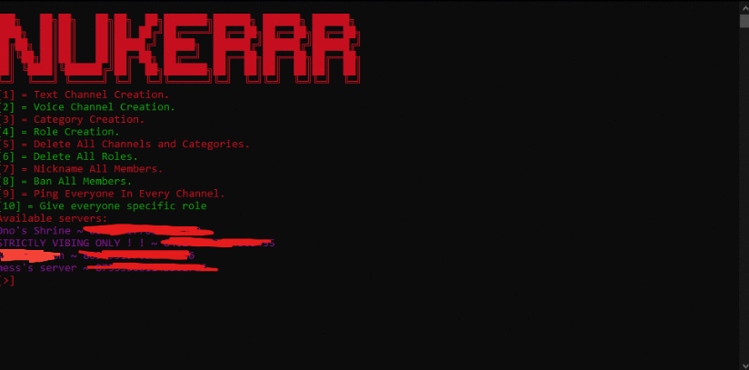

# Discord-Nuker

Use on your own test servers - this is for educational purposes only!

packages required: \
discord.py \
colorama \
\
default features include: \
mass creating of channels - text + voice \
mass creation of categories \
mass creation of roles (with a nice theme) \
deleting all channels \
deleting all roles \
nicknaming everyone \
banning everyone \
mass pinging in every channel

forked version features: \
giving everyone specific role \
seeing guild ids inside the tool

This bot is different from the rest, as no typing in the server is needed, it also has features that I've seen little nukers have, most just spam create roles and text channels..

These actions can be non reversible, please use this bot aware of what it can do and use it with permission!

It's also api abuse so don't use it
